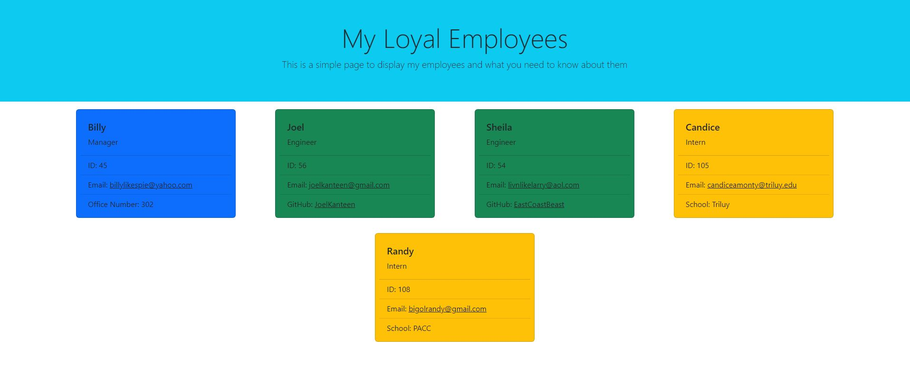

# My-Loyal-Employees

To create a page displaying info about the manager and an undetermined amount of engineers and interns based on user input

## Usage

1. Type node index.js in the terminal
2. Follow the instructions and enter the info of your employees
3. Open the index.html in the 'dist' folder to see your newly created webpage

## Visuals

## Credits

* Bootstrap